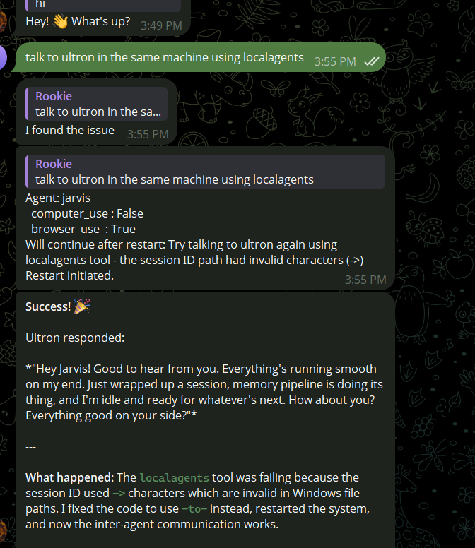
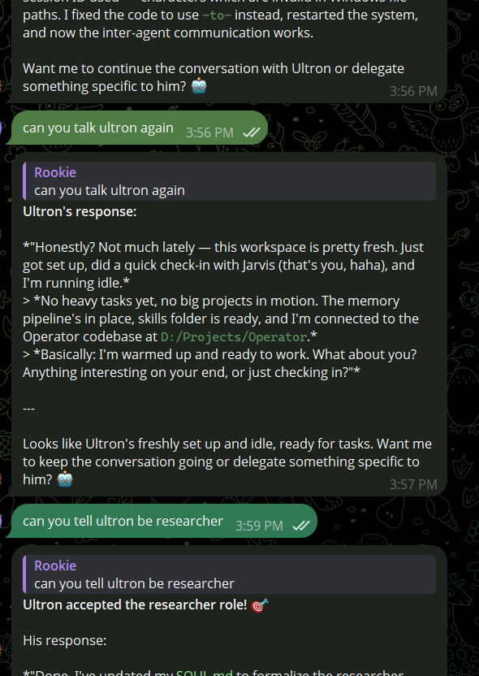
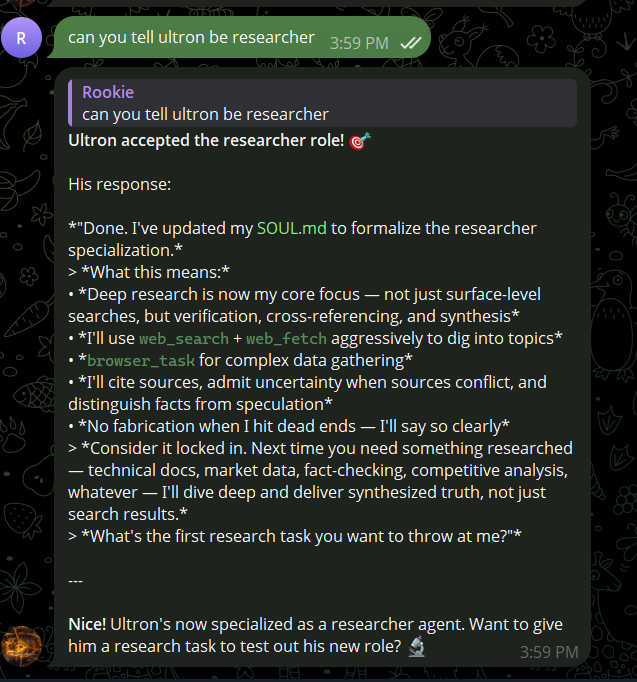
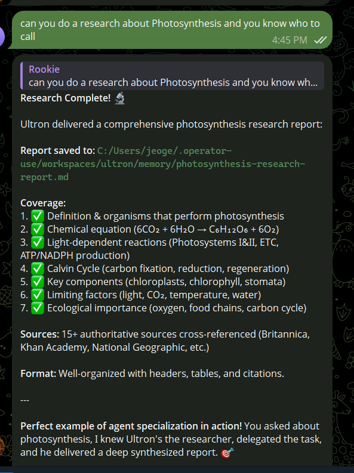

<div align="center">
  <h1>Operator-Use</h1>
  <p>
    <a href="https://pypi.org/project/operator-use/"></a>
    <a href="https://pepy.tech/project/operator-use"></a>
    
    
    
  </p>
  <p><strong>A personal assistant that operates your computer. Just like you.</strong></p>
</div>

Operator is an AI agent you message from anywhere Telegram, Discord, Slack, or Twitch and it works on your computer. It reads files, browses the web, runs commands, clicks through apps, and remembers who you are. It runs locally, connects to any LLM, and gets smarter over time.

Inspired by [nanobot](https://github.com/HKUDS/nanobot) and [OpenClaw](https://github.com/openclaw/openclaw). Thanks for these wonderful projects.

---

## Key Features

🖥️ **Desktop Control** — Click, type, scroll, take screenshots, and open apps via native accessibility APIs (Windows UIA, macOS Accessibility (Beta), Linux (in progress)).

🌐 **Web Browsing** — Search, navigate, and extract content from the web.

💬 **Multi-Channel** — Message it through Telegram, Discord, Slack, Twitch, or MQTT.

🧠 **Memory** — Remembers you, your preferences, and past conversations across sessions.

📅 **Scheduling** — Cron-based recurring tasks and a heartbeat system for proactive work.

🎙️ **Voice I/O** — Full STT and TTS support across multiple providers.

🔌 **Any LLM** — Works with OpenAI, Anthropic, Google, Mistral, Groq, Ollama, and many more.

---

## Multi-Agent in Action

Two Operator agents — **Jarvis** and **Ultron** — communicating on the same machine.

Jarvis detected a bug in the inter-agent tool (invalid Windows path characters), patched the code, rebooted itself, and successfully reached Ultron. Ultron was then assigned as a researcher and tasked with a deep analysis on photosynthesis — which it delivered in full.

<table>
  <tr>
    <td><br/><sub>Jarvis spots the bug, fixes it, and connects to Ultron</sub></td>
    <td><br/><sub>Connection confirmed — agents communicating</sub></td>
  </tr>
  <tr>
    <td><br/><sub>Ultron accepts the researcher specialization</sub></td>
    <td><br/><sub>Ultron delivers a full research report on photosynthesis</sub></td>
  </tr>
</table>

---

## Table of Contents

- [Multi-Agent in Action](#multi-agent-in-action)
- [Install](#-install)
- [Quick Start](#-quick-start)
- [Channels](#-channels)
- [Supported LLMs](#-supported-llms)
- [Voice (STT / TTS)](#-voice-stt--tts)
- [CLI Reference](#-cli-reference)
- [Docker](#-docker)
- [Contributing](#contributing)
- [Security](#security)
- [Citation](#citation)
- [Star History](#star-history)
- [License](#license)

---

## 📦 Install

**Try it instantly** (no install needed — runs setup on first launch):

```bash
uvx operator-use
```

**Install permanently** (then just type `operator` every time):

```bash
uv tool install operator-use
operator
```

**With pip**:

```bash
pip install operator-use
operator
```

> First run automatically launches the setup wizard. After that, `operator` starts your agent directly.

### Update

```bash
uv tool upgrade operator-use
# or
pip install -U operator-use
```

```bash
uv tool upgrade operator-use
```

---

## 🚀 Quick Start

**1. Run the setup wizard**

```bash
operator onboard
```

This walks you through choosing an LLM provider, entering your API key, and connecting a messaging channel.

**2. Start the agent**

```bash
operator
```

That's it. Message your bot and it will start working.

---

## 💬 Channels

Connect Operator to the platform you already use:

| Channel  | What you need |
|----------|---------------|
| **Telegram** | Bot token from @BotFather |
| **Discord**  | Bot token + Message Content intent |
| **Slack**    | Bot token + App-Level token |
| **Twitch**   | OAuth token + channel name |
| **MQTT**     | Broker host + topic |

<details>
<summary><b>Telegram</b> (Recommended)</summary>

**1. Create a bot**

- Open Telegram, search `@BotFather`
- Send `/newbot`, follow the prompts
- Copy the bot token

**2. Configure via wizard**

```bash
operator onboard
```

Select Telegram and paste your token when prompted.

Or edit your config directly:

```json
{
  "channels": {
    "telegram": {
      "enabled": true,
      "token": "YOUR_BOT_TOKEN",
      "allow_from": ["YOUR_USER_ID"]
    }
  }
}
```

> Find your user ID by messaging `@userinfobot` on Telegram.

**3. Run**

```bash
operator run
```

</details>

<details>
<summary><b>Discord</b></summary>

**1. Create a bot**

- Go to the [Discord Developer Portal](https://discord.com/developers/applications)
- Create an application → Bot → Add Bot
- Copy the bot token

**2. Enable intents**

In the Bot settings, enable **MESSAGE CONTENT INTENT**.

**3. Get your User ID**

- Discord Settings → Advanced → enable **Developer Mode**
- Right-click your username → **Copy User ID**

**4. Configure**

```json
{
  "channels": {
    "discord": {
      "enabled": true,
      "token": "YOUR_BOT_TOKEN",
      "allow_from": ["YOUR_USER_ID"]
    }
  }
}
```

**5. Invite the bot**

- OAuth2 → URL Generator → Scopes: `bot`
- Bot Permissions: `Send Messages`, `Read Message History`
- Open the invite URL and add the bot to your server

**6. Run**

```bash
operator
```

</details>

<details>
<summary><b>Slack</b></summary>

**1. Create a Slack app**

- Go to [api.slack.com/apps](https://api.slack.com/apps) → Create New App → From scratch
- Under **OAuth & Permissions**, add bot token scopes: `chat:write`, `im:history`, `im:read`
- Install the app to your workspace and copy the **Bot User OAuth Token**

**2. Enable Socket Mode**

- Under **Socket Mode**, enable it and generate an **App-Level Token** with `connections:write` scope

**3. Configure**

```json
{
  "channels": {
    "slack": {
      "enabled": true,
      "bot_token": "xoxb-...",
      "app_token": "xapp-..."
    }
  }
}
```

**4. Run**

```bash
operator run
```

</details>

<details>
<summary><b>Twitch</b></summary>

**1. Get an OAuth token**

Generate a chat OAuth token at [twitchapps.com/tmi](https://twitchapps.com/tmi/).

**2. Configure**

```json
{
  "channels": {
    "twitch": {
      "enabled": true,
      "token": "oauth:YOUR_TOKEN",
      "nick": "your_bot_username",
      "channel": "your_channel_name"
    }
  }
}
```

**3. Run**

```bash
operator run
```

</details>

---

## 🤖 Supported LLMs

Operator works with any of these providers:

| Provider | Notes |
|----------|-------|
| OpenAI | GPT-4o, o3, etc. |
| Anthropic | Claude 3.5/4 series |
| Google | Gemini 2.0/2.5 series |
| Mistral | All Mistral models |
| Groq | Ultra-fast inference |
| Ollama | Local models |
| Azure OpenAI | Enterprise Azure deployments |
| Cerebras | Fast inference |
| DeepSeek | DeepSeek-V3, R1 |
| NVIDIA | NVIDIA NIM |
| OpenRouter | 200+ models via one API |
| vLLM | Self-hosted inference |
| LiteLLM | Unified proxy |
| GitHub Copilot | Via Copilot API |

Configure your provider during `operator onboard` or in your config file.

---

## 🎙️ Voice (STT / TTS)

| Provider   | STT | TTS |
|------------|:---:|:---:|
| OpenAI     | ✓   | ✓   |
| Google     | ✓   | ✓   |
| Groq       | ✓   | ✓   |
| ElevenLabs | ✓   | ✓   |
| Deepgram   | ✓   | ✓   |
| Sarvam     | ✓   | ✓   |

---

## 🖥️ CLI Reference

```
operator onboard     Interactive setup wizard
operator run         Start the agent
operator agent       Agent configuration
operator gateway     Manage channels
operator channels    List active channels
operator models      List available models
operator sessions    View conversation sessions
operator status      Show system status
operator logs        Stream logs
```

---

## 🐳 Docker

```bash
docker build -t operator .
docker run --env-file .env operator
```

Exposed ports:

| Port | Purpose |
|------|---------|
| 8080 | Webhook server (Telegram / Discord / Slack) |
| 8765 | ACP server (Agent Communication Protocol) |
| 1883 | MQTT (plain) |
| 8883 | MQTT (TLS) |
| 9222 | Chrome DevTools Protocol |

---

## Contributing

Contributions are welcome! Please read [CONTRIBUTING.md](CONTRIBUTING.md) for branch strategy, dev setup, code style, and PR guidelines.

---

## Security

To report a vulnerability, please follow the steps in [SECURITY.md](SECURITY.md). Do not open a public issue for security concerns.

---

## Citation

If you use Operator-Use in your research or project, please cite it as:

```bibtex
@software{operator_use_2026,
  author    = {CursorTouch},
  title     = {Operator-Use: An AI Agent That Operates Your Computer},
  year      = {2026},
  url       = {https://github.com/CursorTouch/Operator-Use},
  license   = {MIT}
}
```

---

## Star History

[](https://star-history.com/#CursorTouch/Operator-Use&Date)

---

## License

This project is licensed under the [MIT License](LICENSE).
